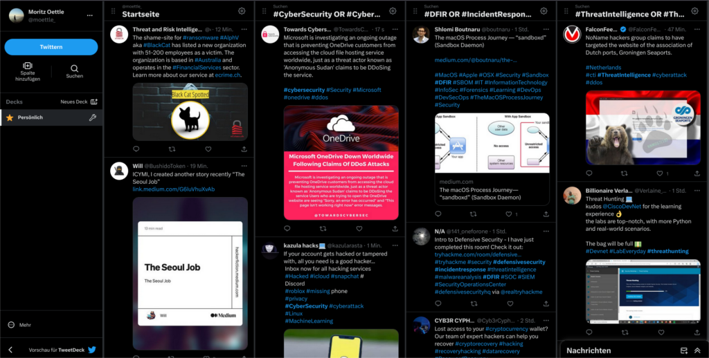

# TL;DR
[Reddit BlueTeamSec](https://www.reddit.com/r/blueteamsec/) and Twitter with the filters mentioned below, will provide you with most of the information you'll need on a daily basis.

# Introduction
Whether you are a novice or a seasoned professional in the field of DFIR, it is crucial to know reliable and comprehensive sources for obtaining information and staying updated. It is equally important to remain open to discovering new resources that can enhance your knowledge. If you have new sources, which are not yet in this list, just send me a message on Twitter or an email.

The following compilation has expanded in recent years and will continue to evolve in this rapidly changing domain. Some resources may be removed or replaced over time.

To gather the majority of my news, I prefer utilizing RSS feeds within my email application. This approach proves convenient as the news articles are delivered directly to my inbox, which I check on a daily basis. However, since not all resources offer RSS feeds and some are more interactive (such as Twitter), it becomes necessary to manually check these sources.

The sources comprise not only DFIR-related material but also a wide range of topics within the realm of cybersecurity. This includes defensive and offensive security, threat landscapes, cyber politics (with a focus on Europe), and more. As an Incident Responder, it is crucial to stay informed about the entire cybersecurity landscape. Relying solely on forensic blogs would provide a limited perspective. While you may possess excellent technical analysis skills for dissecting each system forensically, you would lack the contextual information about the attacks. Contextual information often offers valuable insights into the motivation, capabilities, and objectives of the attacks. For instance, considering the ongoing Ukraine war, attacks on critical infrastructure in Europe are currently more likely to originate from Russia compared to other countries like China or the US. This is not to imply that all attacks come from Russia, but rather that the circumstances increase the probability of such occurrences. Hence, it is important to stay updated about these circumstances and have the big picture in mind while responding to incidents.

# Sources

The following are some of my favorite sources. I added links to RSS feeds and Twitter wherever possible and useful, so you can easily subscribe to them.

| Name  | Tags | RSS  | Twitter  | Note |
|-------|------|------|----------|------|
| [Reddit BlueTeamSec](https://www.reddit.com/r/blueteamsec/)   | Collection, IR, DF, TI, Vulns | [Yes](https://www.reddit.com/r/blueteamsec/new.rss)  | No  | Best and most comprehensive collection of new articles and posts I know so far. That's the first thing I check every day :)  |
| [The DFIR Report](https://thedfirreport.com/)  | Blog, DF, IR, TI  | No  | [Yes](https://twitter.com/TheDFIRReport) | Excellent and very detailed reports about current attacks. |
| [Windows Incident Response](https://windowsir.blogspot.com/) | Blog, DF | [Yes](https://windowsir.blogspot.com/feeds/posts/default) | No  | One of the best forensic blogs out there. Nothing else is to be expected by Harlan Carvey, the author of the books "Windows Forensic Analysis, "Windows Registry Forensics", and many more. |
| [Inversecos](https://www.inversecos.com/) | Blog, IR, DF | No | [Yes](https://twitter.com/inversecos) | Great DFIR blog covering various topics. Low volume but high quality :) |
| [Cyb3erops](https://cyb3rops.medium.com/) | Blog, IR, DF, TI | No | [Yes](https://twitter.com/cyb3rops) | Florian Roth, undoubtedly one of the biggest contributers to the cybersecurity community with projects like Thor, Sigma, Raccine, etc., frequently posts on Twitter. I would also recommend to follow him on Twitter to get the latest news. |
| [JPCert](https://blogs.jpcert.or.jp/en/)  | CERT, DF, IR, MA |  No | [Yes](https://twitter.com/jpcert_en)  | Many nice blog posts about a variety of cybersecurity topics.  |
| [Mandiant Blog](https://www.mandiant.com/resources/blog)  | Vendor, TI  | No  | [Yes](https://twitter.com/Mandiant)  |Mandiant's Threat Intelligence Blog   |
| [Cisco Talos Intelligence](https://blog.talosintelligence.com/)  | Vendor, TI | No  | [Yes](https://twitter.com/TalosSecurity)  | Ciscos' Threat Intelligence Blog   |
| [Unit42](https://unit42.paloaltonetworks.com/)  | Vendor, TI  | No | [Yes](https://twitter.com/Unit42_Intel)  | Palo Alto's Threat Intelligence Blog  |
| [Securelist](https://securelist.com/)  | Vendor, TI  | No | [Yes](https://twitter.com/Securelist)  | Kaspersky's Threat Intelligence Blog  |
| [CISA](https://www.cisa.gov/news-events/cybersecurity-advisories)  | Advisory  | [Yes](https://www.cisa.gov/cybersecurity-advisories/all.xml)  |  [Yes](https://twitter.com/CISACyber) | Cybersecurity & Infrastructure Security Agency published daily advisories on vulnerabilities and more. |
| [Heise Security](https://www.heise.de/security/)  | GER, News  | [Yes](https://www.heise.de/security/rss/news-atom.xml)  | [Yes](https://twitter.com/heisec)  | Go to news feed in germany for all related IT Security topics. Usually not very technical and not directly related to DFIR.  |
| [Netzpolitik.org](https://netzpolitik.org/)  | GER, Politics  | [Yes](https://netzpolitik.org/feed)  | [Yes](https://twitter.com/netzpolitik_org)  | German site (somtimes also english articles) about digital freedom rights.  |
| [Krebs on Security](https://krebsonsecurity.com/)  | Blog  | No  | No  | Security news and investigations  |
| [Security Affairs](https://securityaffairs.com/)  | News  | No  | No  |  News about all cybersecurity-related topics |
| [vx-underground](https://www.vx-underground.org/)  | Collection, MA  | No | [Yes](https://twitter.com/vxunderground)  | Collection of malware samples and source codes  |
| [Darknet Diaries](https://darknetdiaries.com/)  | Podcast  | No  | [Yes](https://twitter.com/DarknetDiaries)  | Well research stories in the realm of hacking and cyber security. One of my favorite podcasts in that area :)  |
| Sandworm  | Book  | No  | No  | "Sandworm: A New Era of Cyberwar and the Hunt for the Kremlin's Most Dangerous Hackers" is a great book and should be read by everyone working in cybersecurity.  |

# Twitter
One of the best platform to get the newest information about cybersecurity is Twitter. For a long time Twitter was the go-to platform for the whole community to share information and news about the newest attacks. Penetration testers share their newest tools and exploits, and threat analysts share their newest intel about current attacks. Since Musk has bought Twitter parts of the community moved to Mastodon or other platforms but still, Twitter is a platform rich in information on cybersecurity. The only thing you need to know is how to use it effectively.

Twitter lets you search for certain tags in their search field. The best tags on Twitter include:

* #CyberSecurity
* #CyberSec
* #InfoSec
* #CyberAttacks
* #DigitalSecurity
* #CyberRisk
* #DFIR
* #IncidentResponse
* #DigitalForensics
* #BlueTeam
* #DefensiveSecurity
* #ThreatIntelligence
* #ThreatIntel
* #ThreatHunting
* #ThreatAnalysis
* #APT
* #CTI
* #OSINT
* #SOC
* #SIEM
* #Yara
* #0Day
* #MalwareAnalysis
* #Malware
* #Ransomware

To bring Twitter's tags to a next level, I use these tags on [TweetDeck](https://tweetdeck.twitter.com/) in different columns, as shown below:

* **Main feed**: Getting news from the people I follow, which might not use tags at all. Note that you shouldn't combine your private and your professional Twitter, otherwise this feed would be full of posts that distract you during work.
* **General news about cybersecurity**:
    * #CyberSecurity OR #CyberSec OR #InfoSec OR #CyberAttacks OR #DigitalSecurity OR #CyberRisk
* **DFIR-related posts**:
    * #DFIR OR #IncidentResponse OR #DigitalForensics OR #BlueTeam OR #DefensiveSecurity
* **TI-related posts**:
    * #ThreatIntelligence OR #ThreatIntel OR #ThreatHunting OR #ThreatAnalysis OR #Yara
* Optional: current topic you want to track like a new vulnerability

> Cover Image by [Freepik](https://www.freepik.com/free-vector/hand-drawn-groovy-psychedelic-background_18038192.htm#query=psychedelic%20pattern&position=1&from_view=keyword&track=ais)